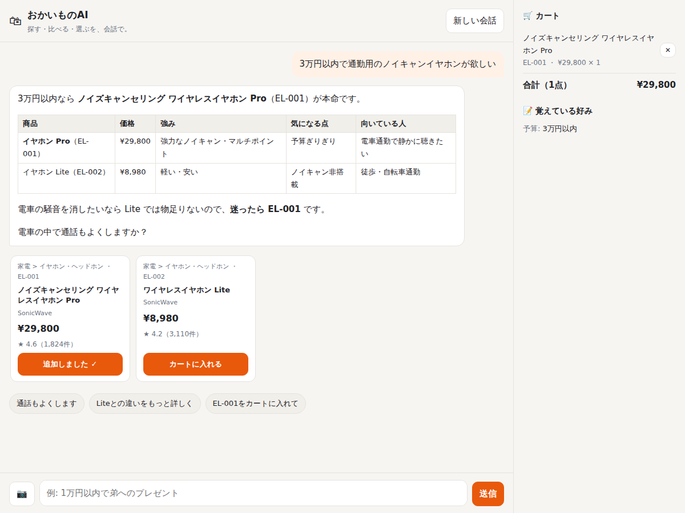

# 🛍 おかいものAI

お買い物について、ChatGPT と同じように自然に会話できる AI アシスタントです。
探す・比べる・選ぶ・カートに入れる、までを会話だけで進められます。

## 仕組み（なぜ「ChatGPT レベル」の会話ができるのか）

ChatGPT と同等の言語モデルをゼロから学習するには、数千億円規模の計算資源とデータが必要です。
そこでこのプロジェクトでは、**トップクラスの大規模言語モデル（Claude Opus 5.5）を頭脳として使い**、
その周りに「買い物に特化した道具・知識・ふるまい」を組み込んでいます。
汎用チャットに比べて、買い物ではむしろ次の点で上回ることを目指しています:

| 機能 | 内容 |
|---|---|
| 🧠 高度な会話 | Claude Opus 5.5 + adaptive thinking（必要なときだけ深く考える）で、あいまいな相談にも自然に対応 |
| 🔎 最新情報 | ウェブ検索・ページ取得で、最新の価格相場・レビュー・新製品を調べ、出典リンク付きで回答 |
| 🏬 ストア連携 | 自社カタログを検索・比較し、在庫やサイズを確認してそのままカートへ。「ノイキャン」「いやほん」「母 プレゼント」「肌荒れ」のような話し言葉・略語・表記ゆれでも探せる |
| 🃏 商品カード | 回答に出てきた商品はカードで表示。サイズ・色を選んでボタン 1 つでカートへ（画面での操作も AI に伝わる） |
| 💡 次の一言の候補 | 回答のあとに「次に聞きそうなこと」の候補ボタンを表示 |
| 📝 好みの記憶 | 予算・サイズ・肌質・好きなブランドなどを会話中に覚えて、以後の提案に反映 |
| 📷 画像理解 | 写真を送ると、写っている商品に似たものや合わせるアイテムを提案 |
| 💬 長い会話 | 会話が長くなると、サーバー側で自動的に要約（compaction）して文脈を保持 |
| 🤝 誠実さ | 売りつけない・推測で価格を言わない・「買わなくていい」も率直に伝える方針をプロンプトで徹底 |
| ⚡ 体験 | 回答をストリーミング表示。「〇〇を検索中…」「在庫を確認します」など AI の途中経過も表示 |

## はじめかた

```bash
pip install -r requirements.txt
export ANTHROPIC_API_KEY=sk-ant-...      # https://console.anthropic.com で取得

# ブラウザで使う
uvicorn shopping_ai.server:app --port 8000
# → http://localhost:8000 を開く

# ターミナルで使う
python -m shopping_ai
```



### 設定（環境変数・すべて任意）

| 変数 | 既定値 | 説明 |
|---|---|---|
| `SHOPPING_AI_MODEL` | `claude-opus-5-5` | 使用モデル |
| `SHOPPING_AI_EFFORT` | `high` | 考える深さ（`low` / `medium` / `high` / `xhigh` / `max`）。下げると速く安くなる |
| `SHOPPING_AI_ENABLE_WEB` | `1` | ウェブ検索・取得を使うか（`0` で無効） |
| `SHOPPING_AI_WEB_MAX_USES` | `8` | 1 回の応答でのウェブ検索の最大回数 |
| `SHOPPING_AI_COMPACTION` | `1` | 長い会話の自動要約 |
| `SHOPPING_AI_SUGGESTIONS` | `1` | 回答後の「次の一言」候補（1 ターンごとに軽い呼び出しが 1 回増える） |
| `SHOPPING_AI_CATALOG` | 同梱のデモカタログ | 商品カタログ JSON のパス |

## 自分のストアにつなぐ

同梱の `shopping_ai/data/catalog.json` は 48 商品（9 カテゴリ）のデモデータです。実際のストアで使うには:

1. **カタログ**: `catalog.json` を同じ形式で差し替えるか、`shopping_ai/catalog.py` の `ProductCatalog`
   を自社の商品 API / DB を叩く実装に置き換えます（`search` / `get` / `categories` の 3 メソッド）。
2. **カート**: `shopping_ai/session.py` の `Cart` を自社のカート API に置き換えます。
3. **セッション保存**: `SessionStore` はメモリ上の実装です。本番では Redis や DB に置き換えてください。
4. **ふるまい**: 口調・方針・ストア独自のルール（送料、返品条件など）は `shopping_ai/prompts.py` に書き足します。
5. **検索の言い換え辞書**: 自社商品に合わせて `shopping_ai/catalog.py` の `SYNONYMS` に語を足すと、検索の当たりが良くなります。

## ファイル構成

```
shopping_ai/
  agent.py      会話ループ（Claude ⇄ ツールの往復、ストリーミング、エラー処理）
  prompts.py    システムプロンプト（コンシェルジュとしての方針）
  tools.py      ツール定義と実行（カタログ検索・カート・好みの記憶・ウェブ検索）
  catalog.py    商品カタログの読み込みと検索
  session.py    会話履歴・カート・好みの保持
  server.py     Web API（FastAPI、SSE ストリーミング）
  cli.py        ターミナル版
  static/index.html  チャット画面
scripts/run_scenarios.py  実 API で代表的な会話を流して品質を確認するスクリプト
tests/                    API キー不要のテスト（偽クライアントでループを検証）
```

## テスト

```bash
pip install -r requirements-dev.txt
pytest                                   # API キー不要
ANTHROPIC_API_KEY=... python scripts/run_scenarios.py   # 実 API で会話品質を確認（料金がかかります）
```

### 品質の測り方

`scripts/run_scenarios.py` は、7 つの代表的な会話（条件が揃った相談 / あいまいなギフト相談 / サイズ確認が必要な購入 /
最新情報が必要な質問 / 買わなくていい相談 / 健康に関わる相談 / 途中で条件が変わる相談）を実際に流し、
AI 審査員がシナリオごとの基準（例:「サイズ未確定のままカートに入れていないか」「売りつけていないか」）で 5 点満点で採点します。
結果は `eval_results/` に保存されるので、プロンプトや設定を変えたら再実行して点数を比べてください。

## 料金の目安

Claude Opus 5.5 は入力 $4 / 出力 $20（100 万トークンあたり）。システムプロンプトとツール定義はキャッシュされるため、
2 往復目以降の入力コストは大きく下がります。コストを抑えたい場合は `SHOPPING_AI_EFFORT=medium` や
`SHOPPING_AI_MODEL=claude-sonnet-5-5` を試してください。ウェブ検索は別途検索回数に応じた料金がかかります。

## 注意

- 決済・住所・カード情報は扱いません（カートまで）。
- ウェブ由来の価格は変動します。AI は「〇月〇日時点」と明記するよう指示されています。
